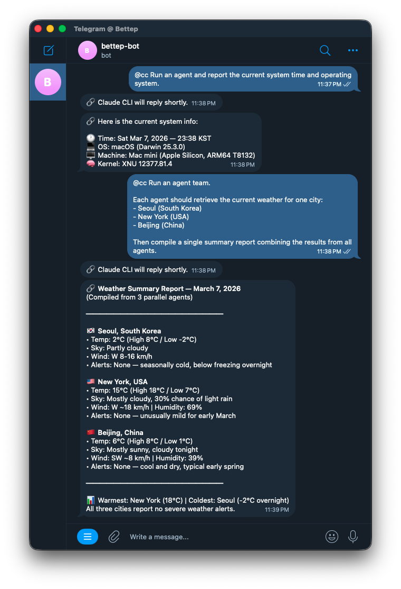
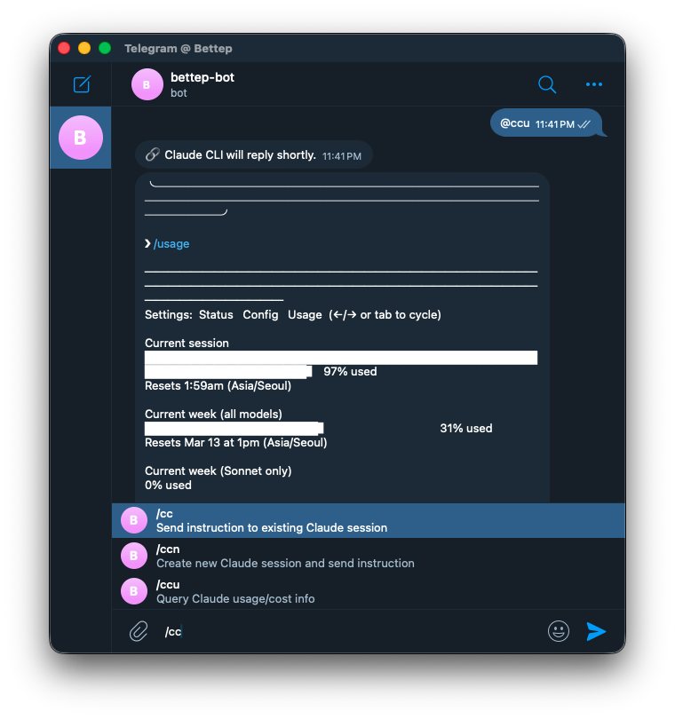

# openclaw-opencode-bridge

[](https://www.npmjs.com/package/openclaw-opencode-bridge)
[](LICENSE)
[](package.json)

> Liked this project? Consider donating!

> EVM Address: 0xe81c32383C8F21A14E6C2264939dA512e9F9bb42

Bridge [OpenClaw](https://openclaw.ai) messaging channels to [OpenCode](https://opencode.ai) via persistent tmux sessions.

Send `@cc` or `/cc` from any chat — your message is routed directly to OpenCode running in your terminal, bypassing the gateway LLM entirely. No separate API keys, no OAuth, no extra costs.

<p>
  
  
</p>

> **⚠️ Telegram only.** This plugin has been developed and tested exclusively with the Telegram channel. Other channels (Discord, Slack, etc.) may use different message formats or metadata wrapping that could break prefix detection or LLM suppression. Community contributions for additional channels are welcome — please open an issue if you encounter problems.

## How It Works


1. User sends a prefixed message (e.g. `@cc deploy the app`)
2. The plugin intercepts the message and suppresses the gateway LLM
3. A shell script forwards the message to OpenCode in a persistent tmux session
4. OpenCode replies back through the same channel via `openclaw message send`

## Prerequisites

| Dependency | Install |
|---|---|
| [OpenClaw](https://openclaw.ai) | `npm i -g openclaw` |
| [OpenCode](https://opencode.ai) | `npm i -g opencode-ai` |
| [tmux](https://github.com/tmux/tmux) | Auto-installed during onboard if missing |

> **Note:** macOS and Linux only. Windows is not supported (tmux dependency).

## Quick Start

```bash
npm i -g openclaw-opencode-bridge
openclaw-opencode-bridge onboard
```

The interactive wizard configures everything — plugin, shell scripts, OPENCODE.md, daemon, and channel settings.

Verify the connection:

```
@cc hello
```

## Commands

| Prefix | Description |
|---|---|
| `@cc` · `/cc` | Send to the current session (retains conversation context) |
| `@ccn` · `/ccn` | Start a fresh session (kills existing, creates new) |
| `@ccu` · `/ccu` | Show OpenCode usage stats |
| `@ccm` · `/ccm` | List OpenCode models |
| `@ccms` · `/ccms` | Set OpenCode model (by number or model-id) |

Messages are sent as-is — no quoting needed:

```
@cc refactor the auth module and add tests
@ccn review this PR: https://github.com/org/repo/pull/42
@ccu
```

Multiline messages and special characters (`$`, `` ` ``, `\`, quotes) are preserved exactly as typed.

## Migration from v1

v2 replaces the legacy skill/hook system with a single OpenClaw plugin:

```bash
npm i -g openclaw-opencode-bridge
openclaw-opencode-bridge onboard
```

The wizard detects and removes legacy components automatically.

## Uninstall

```bash
openclaw-opencode-bridge uninstall
```

Removes all installed components — plugin, shell scripts, OPENCODE.md additions, and daemon.

## Troubleshooting

| Symptom | Fix |
|---|---|
| LLM responds instead of delivery message | `openclaw gateway restart` |
| Delivery confirmed but no reply | Check `tmux ls` — session may have crashed |
| Multiline sends only first line | Re-run `openclaw-opencode-bridge onboard` (v2.0.6+) |

> Forked from [openclaw-claude-bridge](https://github.com/bettep-dev/openclaw-claude-bridge) by [@bettep-dev](https://github.com/bettep-dev) — modified to work with OpenCode instead of Claude CLI.

## License

[MIT](LICENSE)
